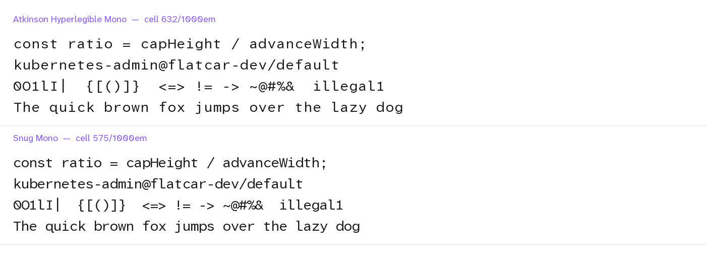

# Snug Mono

Snug Mono is [Atkinson Hyperlegible Mono](https://github.com/googlefonts/atkinson-hyperlegible-next-mono)
with a narrower character cell. The letterforms do not change. Only the empty
space around them becomes smaller.



## Why

Atkinson Hyperlegible Mono is a legibility font, and it reads well. But it puts
each glyph in a cell of 632 units, in a font of 1000 units for each em. Most
monospace fonts use about 600 units. The cap height is also short. As a result,
the text looks spaced out at every size.

The ratio of cap height to cell width shows the difference:

| Font | Cell | Cap height | Cap / cell |
|---|---|---|---|
| Menlo | 602 | 729 | 1.211 |
| IBM Plex Mono | 600 | 698 | 1.163 |
| SF Mono | 618 | 705 | 1.140 |
| Atkinson Hyperlegible Mono | 632 | 668 | 1.057 |
| **Snug Mono** | **575** | **668** | **1.162** |

Snug Mono is the same font at a ratio of 1.162, which is the ratio of IBM Plex
Mono.

Some terminals can do this with a setting. Ghostty has `adjust-cell-width` and
Kitty has `modify_font cell_width`. These settings have two limits. They apply
to one application only. They also round to whole pixels, so the result changes
when you change the font size. Snug Mono moves the correction into the font, so
it is exact at every size and it works in every application.

## Install

1. Clone this repository:

   ```sh
   git clone https://github.com/ralgozino/snug-mono.git
   ```

2. Run the install script:

   ```sh
   cd snug-mono && ./install.sh
   ```

3. Set the font of your terminal or your editor to `Snug Mono`.

The script copies the fonts to `~/Library/Fonts` on macOS, or to
`~/.local/share/fonts` on Linux.

## Configure your terminal

For Ghostty, put this line in `~/.config/ghostty/config`:

```
font-family = Snug Mono
```

If you use `adjust-cell-width`, or a negative letter-spacing value in your
editor, remove it. Snug Mono makes it unnecessary, and the two corrections add
up.

Note: Snug Mono keeps the short cap height of the source font. As a result it
reads smaller than Menlo at the same point size. If the text looks too small,
increase the font size by one point.

## Build it yourself

The build script downloads the source font and writes the fonts in `fonts/`. It
needs Python 3 and `fonttools`:

```sh
pip install fonttools
python3 build.py
```

To use a different amount, give a factor to the script. The default is 0.91:

```sh
python3 build.py 0.88
```

A factor of 0.91 gives the proportions of IBM Plex Mono. A factor of 0.87 gives
the proportions of Menlo. Below about 0.85 the wide glyphs, such as `W` and `@`,
start to touch their neighbors.

The script makes the cell narrower and moves every outline to the center of the
new cell. It moves the marks by the same amount, so accents stay above their
base letters. It then writes a new family name. The new name keeps the font separate from
the original, so both can be installed at the same time.

## Update

The build script always downloads the current source font. To update, run the
build script and then the install script again:

```sh
python3 build.py && ./install.sh
```

A GitHub Action does the same task every Monday. If the source font changed,
the action commits the new fonts to this repository. Then you only pull and run
`./install.sh`.

The file [UPSTREAM](UPSTREAM) records the version of the source font that the
current fonts come from.

## The hyphen still has space around it

This is correct, and Snug Mono does not change it. The hyphen of the source font
is short, at 274 units. The en-dash is 422 units, the minus sign is 496 units,
and the em-dash is 562 units. All four are at the same height, so the length is
the only difference between them. The short hyphen makes that difference clear,
which is what a legibility font is for.

## License

Snug Mono uses the SIL Open Font License 1.1, the same license as the source
font. The full text is in [OFL.txt](OFL.txt).

The source font has no Reserved Font Name, so a modified version is permitted.
This font uses a different family name because "Atkinson Hyperlegible" is a
trademark of the Braille Institute.

## Credit

Atkinson Hyperlegible Mono is the work of Applied Design Works and Letters from
Sweden, for the [Braille Institute](https://www.brailleinstitute.org/). The
designers are Elliott Scott, Megan Eiswerth, Linus Boman, Theodore Petrosky and
Letters from Sweden.

Snug Mono changes the metrics only. All of the drawing is theirs.
